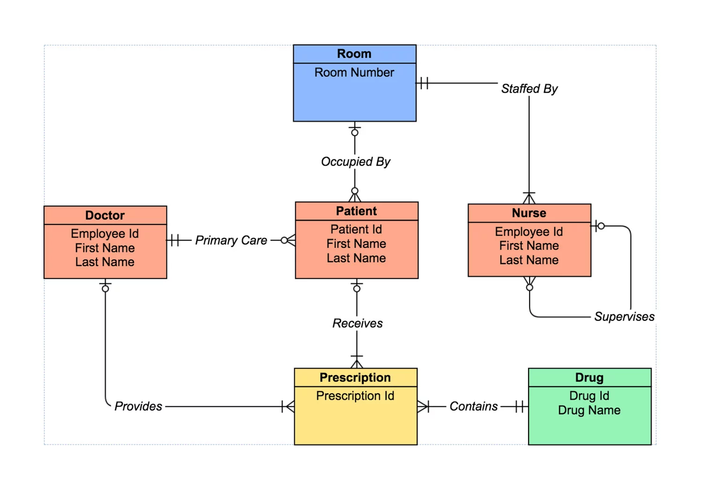

<script type="text/javascript">
  // When the document is fully rendered...
  $(document).ready(function() {
    // ...select all header elements...
    $('h1, h2, h3, h4, h5').each(function() {
      // ...and add an id to them corresponding to their 'titles'
      $(this).attr('id', $(this).html());
    });
  });
</script>


## 目录

<a href="#RMDBS简介和MySQL入门">RMDBS简介和MySQL入门</a><br>
<a href="#选择和筛选 - Select及Where语句">选择和筛选 - Select及Where语句</a><br>
<a href="#条件判断 - case when语句">条件判断 - case when语句</a><br>
<a href="#字符匹配">字符匹配</a><br>
<a href="#联合多表查询">联合多表查询</a><br>
<a href="#汇总和函数">汇总和函数</a><br>


## 关系型数据库(RMDBS)简介和MySQL入门

### 关系型数据库

#### 什么是关系型数据库

1. 百度百科版本

关系数据库，是建立在关系模型基础上的数据库，借助于集合代数等数学概念和方法来处理数据库中的数据。现实世界中的各种实体以及实体之间的各种联系均用关系模型来表示。关系模型是由埃德加·科德于1970年首先提出的，并配合“科德十二定律”。现如今虽然对此模型有一些批评意见，但它还是数据存储的传统标准。标准数据查询语言SQL就是一种基于关系数据库的语言，这种语言执行对关系数据库中数据的检索和操作。 关系模型由关系数据结构、关系操作集合、关系完整性约束三部分组成。

2. 通俗版本
表格+关系+操作

#### 常见软件

Oracle、DB2、PostgreSQL、Microsoft SQL Server、Microsoft Access、MySQL、Sqlite

#### E-R图/实体-联系图

E-R图也称实体-联系图(Entity Relationship Diagram)，提供了表示实体类型、属性和联系的方法，用来描述现实世界的概念模型。



#### 名词解释
1. 模式(Schema): 数据库的组织和结构（有什么表、函数，表的格式是什么）
2. 数据库(Database): 表、关系、操作的总称
3. 表(Table): 二维数据存储，包含名称、数据类型和数据记录
4. 索引(Index): 一列或多列的值进行排序的一种结构，使用索引可快速访问数据库表中的特定信息
5. 键(Key): 用来进行索引的一列或多列，常见的有主键和外键

### MySQL操作

1. 查看范例数据库, `describe`
2. 解释数据类型
```
int: integer, 整数
bigint: big integer，大整数，主要用于位数比较多的
float: 浮点数，带小数点
double：双浮点，更长的浮点数
varchar: 字符，需要定义长度
text: 文本
date/datetime: 时间
boolean: 逻辑，0/1
```

3. 创建数据库和表 `create table`
```
create table student(
  sid        bigint,
  school     varchar(45),
  degree     varchar(45),
  department text,
  firstname  varchar(45),
  lastname   varchar(45),
  bday       date,
  height     int,
  gender     varchar(4)
)
```

4. 导入数据 - workbench gui
5. 增删改 `insert into, alter - col name, dtype, update + set value, drop`
6. 排序


## 选择和筛选 - Select及Where语句

### Select语句

所有sql操作当中最常用的功能，语法为
```
select [variable(s)]
  | from [table(s)]
```
时常和`limit`一起使用，只返回前n行


#### 实例
1. `select 1+2 (from dual)`
2. `select * from sakila.actor`
3. `select first_name, last_name from sakila.actor`
4. `select first_name, last_name from sakila.actor limit 10`


### Where语句

条件筛选，语法为
```
select [variable(s)]
from [table(s)]
where [condition(s)]
```
#### 实例
1. 选择所有演员
```
select * from sakila.actor
```
2. 选择所有名字叫做Kevin演员
```
select first_name, last_name
from sakila.actor
where first_name = 'Kevin'
```

#### 多个条件

当有多个筛选条件的时候，我们需要动用逻辑运算符号符号来表示我们的筛选条件，以下是最常见的几种:


| 逻辑运算           | 含义                             |
|--------------------|----------------------------------|
| =                  | 等于                             |
| >                  | 大于                             |
| <                  | 小于                             |
| >=                 | 大于等于                         |
| <=                 | 小于等于                         |
| <>/!=              | 不等于                           |
| BETWEEN … AND   …  | 在两个值当中，包含端点           |
| AND                | 逻辑与，左右两边条件都为真       |
| OR                 | 逻辑或，左右两边条件至少一个为真 |
| IN (a,b,c,...)     | 取值符合括号中任意一个值         |
| NOT IN (a,b,c,...) | 取值不符合括号中所有值           |


#### 实例
1. 归还日期在两个日期之间的记录
```
select * from sakila.rental
where return_date between '2005-05-27' and '2005-05-30'
```

2. PG-13评级并且时长90分钟以上
```
select * from sakila.film category
where rating = 'PG-13' and length > 90
```

3. 评级为PG-13或者R
```
select * from sakila.film category
where rating = 'PG-13' or rating = 'R'
```
或者
```
select * from sakila.film category
where rating IN ('PG-13', 'R')
```

### Distinct语句
去重、保留唯一不同的值，可以针对一列或者多列
```
select distinct [variable(s)]
from [table(s)]
```

#### 实例
1. 选择所有不同的评级
```
select distinct rating
from sakila.film
```

2. 选择所有不同的评级和语言的组合
```
select distinct rating, language_id
from sakila.film
```


## 条件判断 - case when语句

根据条件来执行一个或多个操作。如果不满足条件，可以选择性地执行其他操作。语法为

```
CASE expression
    WHEN condition1 THEN result1
    WHEN condition2 THEN result2
   ...
    WHEN conditionN THEN resultN
    ELSE result
END
```

返回结果是一个变量，经常用来构造新的列

#### 实例
1. 如果国家是中国，返回1；亚美尼亚，返回2；其他返回3
```
select
	country,
	case 
		when country = 'China' then 1
		when country = 'Armenia' then 2
		else 3
    end as ccode
from sakila.country
```

### 缺失值处理

现实生活中的数据并不完美，会出现一些缺失值，需要进行数据处理才可以继续使用，否则会影响到后续的分析效果。缺失值我们称其为null。

#### 实例
插入一个缺失值
```
insert into school.student values (2015001, 'Performing Art', 'Bachelor', 'Musical', 'Changyong', 'Liao',NULL)
```

查找90后
```
select * from school.student
where bday > '1989-12-31'
```

查找90前
```
select * from school.student
where bday <= '1989-12-31'
```
都找不到，因为NULL做条件时候当做False处理。可以用`is NULL`来判断一个值是不是缺失值

```
select * from school.student
where bday is NULL
```

同样可以使用的有`ISNULL`函数

```
select * 
from school.student
where ISNULL(bday)
```

```
select firstname, lastname,
  case
    when isnull(bday) then '1900-12-31'
    else bday
  end as bday_est
from school.student
```

## 字符匹配

### 通配符
在搜索数据库中的数据时，SQL 通配符可以替代一个或多个字符，进而实现对于字符或者文本变量的模糊搜索。在SQL当中，可以使用`like`语句来使用通配符。

#### 常见通配符

通配符|描述
---|---
%	|替代一个或多个字符
_	|仅替代一个字符
[charlist]|字符列中的任何单一字符
[^charlist]/[!charlist]|不在字符列中的任何单一字符

注意：
1. MySQL不支持[charlist]类型的通配符，其他数据库软件可能支持;
2. 如果想要匹配"_"，可以使用转义字符"\\".

#### 通配符实例

有如下字符
```
Beijing
Beika
Shanghai
Shandong
Tokyo
New_York
```

1. 以B开头的`B%`

<pre>
<b>Beijing</b>
<b>Beika</b>
Shanghai
Shandong
Tokyo
New_York
</pre>

2. 中间包含an的`%an%`

<pre>
Beijing
Beika
<b>Shanghai</b>
<b>Shandong</b>
Tokyo
New_York
</pre>

3. 第一个字符以后是hanghai的`_hanghai`

<pre>
Beijing
Beika
<b>Shanghai</b>
Shandong
Tokyo
New_York
</pre>

4. 第一个字符是B或者T`[BT]%`

<pre>
<b>Beijing</b>
<b>Beika</b>
Shanghai
Shandong
<b>Tokyo</b>
New_York
</pre>


5. 第一个字符不是B或者T`[!BT]%`

<pre>
Beijing
Beika
<b>Shanghai</b>
<b>Shandong</b>
Tokyo
New_York
</pre>

6. 带有"_"的`%\_%`

<pre>
Beijing
Beika
Shanghai
Shandong
Tokyo
<b>New_York</b>
</pre>

#### 通配符在SQL中的应用

1. 名字以K开头的学生

```
select *
from school.student
where firstname like "K%"
```
2. 名字第一个字符后面是"ukun"的学生
```
select *
from school.student
where firstname like '_ukun'
```

### 正则表达式

正则表达式，又称规则表达式。（英语：Regular Expression，在代码中常简写为regex、regexp或RE），计算机科学的一个概念。正则表达式是对字符串操作的一种逻辑公式，就是用事先定义好的一些特定字符、及这些特定字符的组合，组成一个“规则字符串”，这个“规则字符串”用来表达对字符串的一种过滤逻辑。

#### 常见正则表达式语法

正则表达式语法较为复杂，常用的有

| 字符   | 描述                                                                                                                                                                                                                                             |
|--------|--------------------------------------------------------------------------------------------------------------------------------------------------------------------------------------------------------------------------------------------------|
| \      | 将下一个字符标记为一个特殊字符、或一个原义字符、或一个向后引用、或一个八进制转义符。例如，“n”匹配字符“n”。“\n”匹配一个换行符。串行“\\”匹配“\”而“\(”则匹配“(”。                                                                                   |
| ^      | 匹配输入字符串的开始位置。如果设置了RegExp对象的Multiline属性，^也匹配“\n”或“\r”之后的位置。                                                                                                                                                     |
| $      | 匹配输入字符串的结束位置。如果设置了RegExp对象的Multiline属性，$也匹配“\n”或“\r”之前的位置。                                                                                                                                                     |
| *      | 匹配前面的子表达式零次或多次。例如，zo*能匹配“z”以及“zoo”。                                                                                                                                                                         |
| +      | 匹配前面的子表达式一次或多次。例如，“zo+”能匹配“zo”以及“zoo”，但不能匹配“z”。                                                                                                                                                       |
| ?      | 匹配前面的子表达式零次或一次。例如，“do(es)?”可以匹配“does”或“does”中的“do”                                                                                                                                                      |
| .      | 匹配除“\n”之外的任何单个字符。要匹配包括“\n”在内的任何字符，请使用像“(.|\n)”的模式。                                                                                                                                                             |
| x|y    | 匹配x或y。例如，“z|food”能匹配“z”或“food”。“(z|f)ood”则匹配“zood”或“food”。                                                                                                                                                                      |
| [xyz]  | 字符集合。匹配所包含的任意一个字符。例如，“[abc]”可以匹配“plain”中的“a”。 |
| [^xyz] | 负值字符集合。匹配未包含的任意字符。例如，“[^abc]”可以匹配“plain”中的“p”。                                                                                                                                                                       |
| [a-z]  | 字符范围。匹配指定范围内的任意字符。例如，“[a-z]”可以匹配“a”到“z”范围内的任意小写字母字符。                                                                                                                                                      |
| [^a-z] | 负值字符范围。匹配任何不在指定范围内的任意字符。例如，“[^a-z]”可以匹配任何不在“a”到“z”范围内的任意字符。                                                                                                                                         |
| \\n     | 匹配一个换行符。等价于`\x0a`和`\cJ`。                                                                                                                                                                                                                |
| \\s     | 匹配任何空白字符，包括空格、制表符、换页符等等。等价于`[ \f\n\r\t\v]`。|
| \\S     | 匹配任何非空白字符。等价于`[^ \f\n\r\t\v]`。                                                                                                                                                                                                       |
| \\t     | 匹配一个制表符。等价于`\x09`和`\cI`。                                                                                                                                                                                                                |
| \\w     | 匹配包括下划线的任何单词字符。等价于“[A-Za-z0-9_]”。                                                                                                                                                                                             |
| \\W     | 匹配任何非单词字符。等价于“[^A-Za-z0-9_]”。                                                                                                                                                                                                      |
参考资料：<br>
[表格参考](https://www.jb51.net/shouce/jquery/regexp.html)<br>
[正则表达式教程](https://www.regular-expressions.info)<br>
[正则表达式在线测试](https://regex101.com)

正则表达式的强大之处在于可以通过"|"组合使用。


#### 正则表达式实例

1. 所有数字和字母

`[0-9a-zA-Z]+`

2. 开头是B结尾是y

`^B.*y$`

3. 所有数字和字母，或者结尾是"*"

`[0-9a-zA-Z]+|\*$`

#### 正则表达式在SQL中的应用

如果想使用正则表达式，那么可以使用`rlkie`语句

1. 名字结尾是g的
```
select firstname, lastname
from school.student
where firstname rlike '.*g$'
```

## 联合多表查询

在实际应用中经常需要从多个数据表中读取数据，这就是JOIN操作。

### JOIN的分类

JOIN 按照功能大致分为如下三类：

JOIN类型|作用
---|---
INNER JOIN（内连接,或等值连接）|获取两个表中字段匹配关系的记录。
LEFT JOIN（左连接）|获取左表所有记录，即使右表没有对应匹配的记录。
RIGHT JOIN（右连接）| 与 LEFT JOIN相反，用于获取右表所有记录，即使左表没有对应匹配的记录。
FULL JOIN（全连接）| 左连接和又连接的组合版本，左右表都有对应匹配记录

#### JOIN的实例

1. INNER JOIN

```
select s.sid, s.firstname, s.lastname, r.cid
from student s
inner join registration r
on s.sid = r.sid
```
有时也可以简化成下面的语法

```
select s.sid, s.firstname, s.lastname, r.cid
from student s, registration r
where s.sid = r.sid
```

2. LEFT JOIN

```
select s.sid, s.firstname, s.lastname, r.cid
from student s
left join registration r
on s.sid = r.sid
```

可以看出来蔡徐坤没有选课

3. RIGHT JOIN

```
select c.cid, c.class, r.sid
from registration r
right join classes c
on r.cid = c.cid
```

可以看出来数学、物理、篮球课没有人选

4. FULL JOIN

MySQL不支持FULL JOIN


## 汇总和函数

SQL真正的威力在于可以方便地通过汇总计算记录数、平均值、极值、求和等。

### 汇总函数

```
AVG
COUNT
MIN
MAX
SUM
```

#### 实例

1. 选择所有人的平均身高
```
select avg(height)
from school.student
```

2. 选择最高的
```
select max(height)
from school.student
```

3. 查看一共有多少记录
```
select count(*)
from school.student
```

### 分类汇总

使用`group by`语句来把数据进行分组，然后计算组内的统计数值，基本语法为

```
select [group key(s)], [summary statistics]
from table
group by [group key(s)]
```

这里注意，所有用来做分类的列必须既在select当中，又在group by当中

#### 实例

1. 选择不同性别的平均身高
```
select gender, avg(height)
from school.student
group by gender
```

2. 选择不同学院的最大身高
```
select gender, max(height)
from school.student
group by gender
```

3. 选择不同学院不同性别的最大身高
```
select gender, school, max(height)
from school.student
group by gender, school
```

### Where和Having

在汇总当中也可以加入条件，where和having是两种常用的形式。他们的区别在于生效的时间，具体来讲就是
1. Where在group by之前进行，汇总将会在一个已经经过筛选的子表当中进行
2. Having在group by之后进行，汇总将会先在全部数据当中进行汇总，然后结果只返回符合having条件的记录

#### 实例

1. 商学院当中不同姓氏同学的平均身高
```
select school, lastname, avg(height)
from school.student
where school = 'Business'
group by lastname


select school, lastname, avg(height)
from school.student
group by school, lastname
having school = 'Business'
```