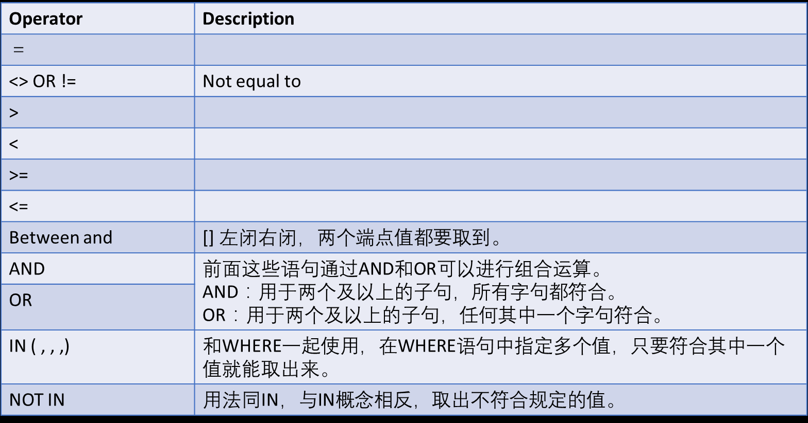

<script type="text/javascript">
  // When the document is fully rendered...
  $(document).ready(function() {
    // ...select all header elements...
    $('h1, h2, h3, h4, h5').each(function() {
      // ...and add an id to them corresponding to their 'titles'
      $(this).attr('id', $(this).html());
    });
  });
</script>


## 目录

<a href="#RMDBS简介和MySQL入门">RMDBS简介和MySQL入门</a><br>
<a href="#选择和筛选 - Select及Where语句">选择和筛选 - Select及Where语句</a><br>
<a href="#条件判断 - case when语句">条件判断 - case when语句</a><br>

## RMDBS简介和MySQL入门

### 关系型数据库

#### 什么是关系型数据库

1. 百度百科版本

关系数据库，是建立在关系模型基础上的数据库，借助于集合代数等数学概念和方法来处理数据库中的数据。现实世界中的各种实体以及实体之间的各种联系均用关系模型来表示。关系模型是由埃德加·科德于1970年首先提出的，并配合“科德十二定律”。现如今虽然对此模型有一些批评意见，但它还是数据存储的传统标准。标准数据查询语言SQL就是一种基于关系数据库的语言，这种语言执行对关系数据库中数据的检索和操作。 关系模型由关系数据结构、关系操作集合、关系完整性约束三部分组成。

2. 通俗版本
表格+关系+操作

#### 常见软件

Oracle、DB2、PostgreSQL、Microsoft SQL Server、Microsoft Access、MySQL、Sqlite

#### E-R图/实体-联系图

E-R图也称实体-联系图(Entity Relationship Diagram)，提供了表示实体类型、属性和联系的方法，用来描述现实世界的概念模型。


#### 名词解释
1. 模式(Schema): 数据库的组织和结构（有什么表、函数，表的格式是什么）
2. 数据库(Database): 表、关系、操作的总称
3. 表(Table): 二维数据存储，包含名称、数据类型和数据记录
4. 索引(Index): 一列或多列的值进行排序的一种结构，使用索引可快速访问数据库表中的特定信息
5. 键(Key): 用来进行索引的一列或多列，常见的有主键和外键

### MySQL操作

1. 查看范例数据库, `describe`
2. 解释数据类型
  `int, bigint, float, double, varchar, text, date, datetime, boolean`
3. 创建数据库和表 `create table`
```
create table student(
  sid        bigint,
  school     varchar(45),
  degree     varchar(45),
  department text,
  firstname  varchar(45),
  lastname   varchar(45),
  bday       date
)
```

4. 导入数据 - workbench gui
5. 增删改 `insert into, alter - col name, dtype, update + set value, drop`
6. 排序


## 选择和筛选 - Select及Where语句

### Select语句

所有sql操作当中最常用的功能，语法为
```
select [variable(s)]
  | from [table(s)]
```
时常和`limit`一起使用，只返回前n行


#### 实例
1. `select 1+2 (from dual)`
2. `select * from sakila.actor`
3. `select first_name, last_name from sakila.actor`
4. `select first_name, last_name from sakila.actor limit 10`

### Distinct语句
去重、保留唯一不同的值，可以针对一列或者多列
```
select distinct [variable(s)]
from [table(s)]
```

#### 实例
1. 选择所有不同的评级
```
select distinct rating
from sakila.film
```

2. 选择所有不同的评级和语言的组合
```
select distinct rating, language_id
from sakila.film
```

### Where语句

条件筛选，语法为
```
select [variable(s)]
from [table(s)]
where [condition(s)]
```
#### 实例
1. 选择所有演员
```
select * from sakila.actor
```
2. 选择所有名字叫做Kevin演员
```
select first_name, last_name
from sakila.actor
where first_name = 'Kevin'
```

#### 多个条件

使用逻辑运算符号


#### 实例
1. 归还日期在两个日期之间的记录
```
select * from sakila.rental
where return_date between '2005-05-27' and '2005-05-30'
```

2. PG-13评级并且时长90分钟以上
```
select * from sakila.film category
where rating = 'PG-13' and length > 90
```

3. 评级为PG-13或者R
```
select * from sakila.film category
where rating = 'PG-13' or rating = 'R'
```
或者
```
select * from sakila.film category
where rating IN ('PG-13', 'R')
```


## 条件判断 - case when语句

根据条件来执行一个或多个操作。如果不满足条件，可以选择性地执行其他操作。语法为

```
CASE expression
    WHEN condition1 THEN result1
    WHEN condition2 THEN result2
   ...
    WHEN conditionN THEN resultN
    ELSE result
END
```

返回结果是一个变量，经常用来构造新的列

#### 实例
1. 如果国家是中国，返回1；亚美尼亚，返回2；其他返回3
```
select
	country,
	case 
		when country = 'China' then 1
		when country = 'Armenia' then 2
		else 3
    end as ccode
from sakila.country
```

### 缺失值处理

插入一个缺失值
```
insert into student values (2015001, 'Performing Art', 'Bachelor', 'Musical', 'Changyong', 'Liao',NULL)
```

查找90后
```
select * from student
where bday > '1989-12-31'
```

查找90前
```
select * from student
where bday <= '1989-12-31'
```
都找不到，因为NULL做条件时候当做False处理。可以用`is NULL`来判断一个值是不是缺失值

```
select * from student
where bday is NULL
```

同样可以使用的有`ISNULL`函数

```
select * from student
where ISNULL(bday)
```

```
select firstname, lastname,
  case
    when isnull(bday) then '1900-12-31'
    else bday
  end as bday_est
from student
```


